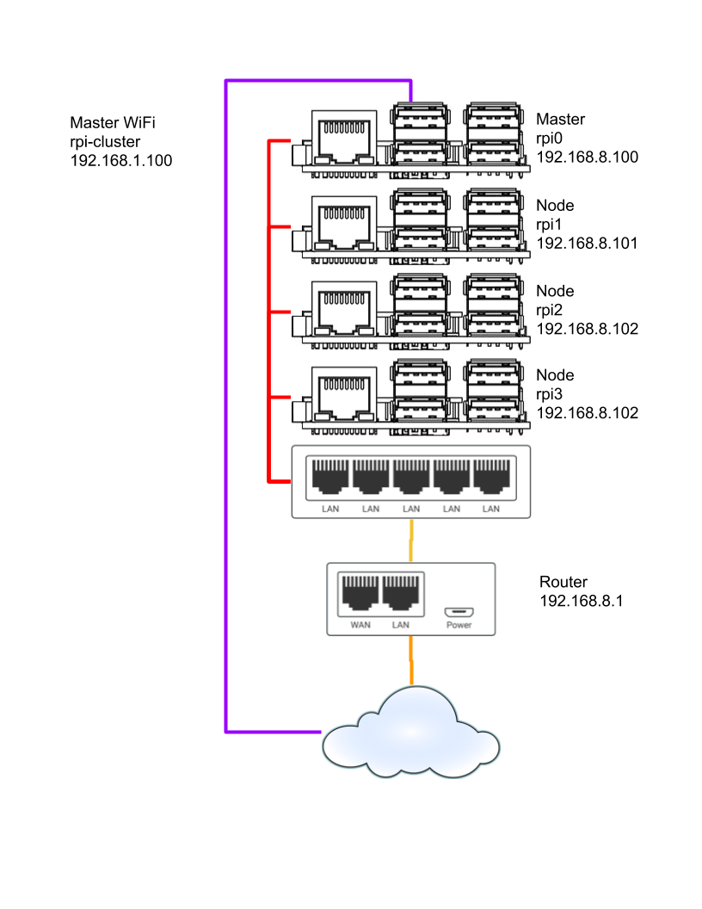

# Raspberry Pi Cluster control
This is a collection of simple services written as a learning project to report status and control LEDs on a 4 mode Raspberry PI cluster.

The services are shown here:

My cluster looks like this:


## Install and setup
### Copy files from Github
On each node:

```bash
git clone https://github.com/rodneyshupe/RPi-Cluster-Control.git ~/cluster_control
```
Run the install script:
```bash
chmod +x ~/cluster_control/scripts/*.sh
~/cluster_control/scripts/install.sh
```

On the **Master** node you need to add the argumane `master` to the install call.
```bash
chmod +x ~/cluster_control/scripts/*.sh
~/cluster_control/scripts/install.sh master
```
### Customization
Each service has its own configuration file.  To create custom settings copy the `_default.py` configration file to a file with `_custom.py`
